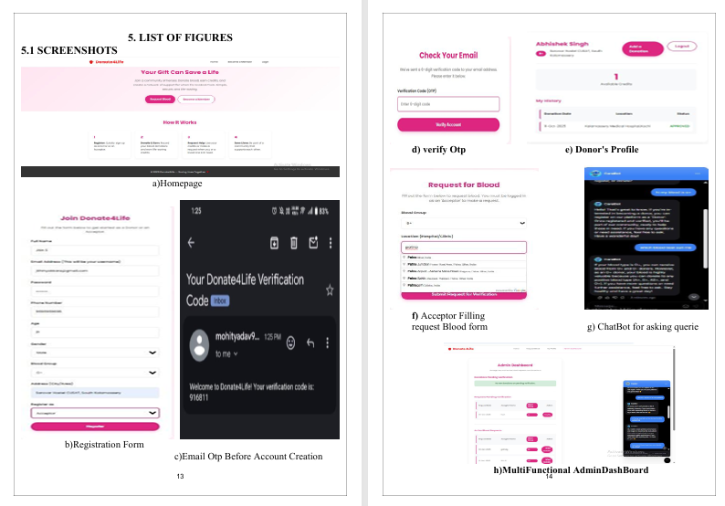
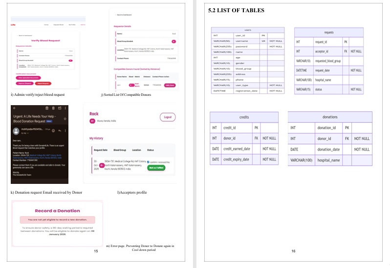
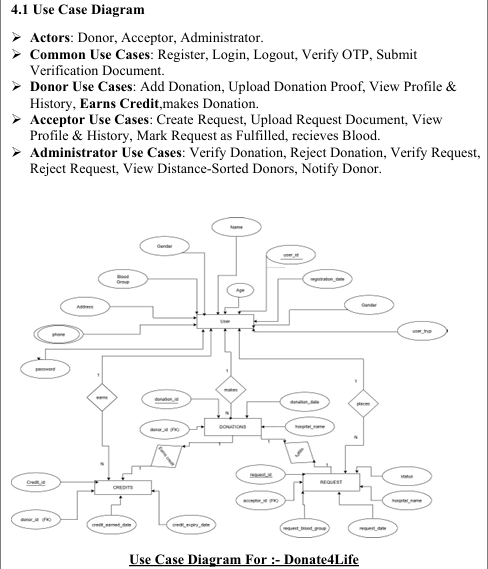
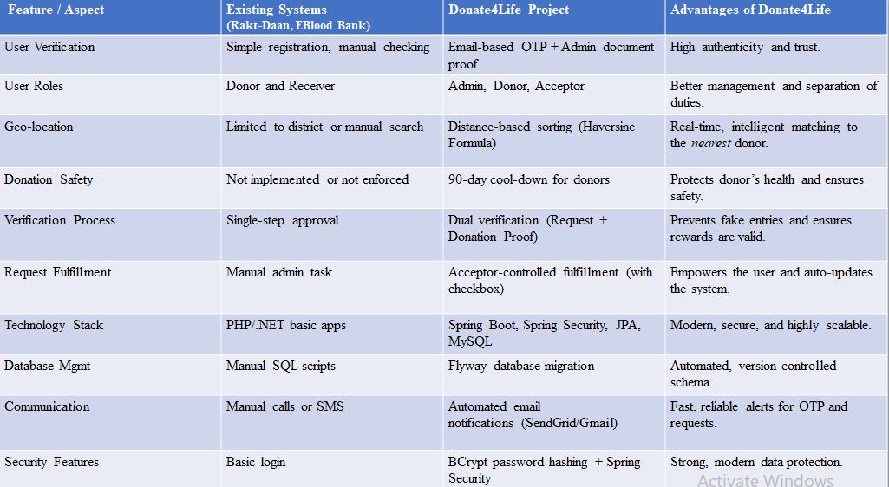

# Donate4Life - Blood Donation Management System

Donate4Life is a secure web application that connects blood donors with recipients. It streamlines the donation process using geolocation-based matching, verification workflows, and role-based security.

## Features

### Security and Authentication
- Role-Based Access Control (RBAC) with three roles: Admin, Donor, Acceptor.
- Email verification using OTP (One-Time Password) before account activation.
- Password hashing using BCrypt via Spring Security.

### Intelligent Matching
- Geolocation capture using Google Places Autocomplete API to store latitude and longitude during registration and request creation.
- Distance calculation using the Haversine Formula to sort and display the nearest compatible donors first.

### Verification Workflow
- Admin verification of blood requests (based on uploaded hospital documents).
- Admin verification of donations (based on uploaded donation certificates).
- Acceptors can mark their own requests as "Fulfilled" through a confirmation workflow, which automatically closes the request.

### Donor Safety
- Enforces a 90-day cooldown period after a verified donation before a donor can donate again.

### Notifications
- Automated emails using Gmail and JavaMailSender for OTPs, donation requests, and status updates.

## Technology Stack

- Backend: Java 21, Spring Boot 3.3.5
- Security: Spring Security 6
- Database: MySQL 8.0
- ORM: Spring Data JPA / Hibernate
- Database Migration: Flyway
- Frontend: Thymeleaf, HTML5, CSS3, JavaScript
- APIs: Google Maps (Places) API, Gmail API
- Build Tool: Maven

## Prerequisites

Before running the application, ensure the following are installed:

- JDK 21
- Maven
- MySQL Server

## Configuration

Configure the src/main/resources/application.properties file with your local database details and API keys:
## How to Run
- Clone the repository:

Open terminal and type this :

- git clone [https://github.com/Mohit-72in/Donate-4-life]
cd donate4life/01-spring-boot-donate-for-life

# Create the Database: Open your MySQL Workbench or terminal and run:

- SQL
CREATE DATABASE projectD4L;
(Note: You do not need to create tables. Flyway will automatically create them when the app starts.)

# Build the Project:
Bash
- mvn clean install

# Run the Application:

Bash
- mvn spring-boot:run
- Access the App: Open your browser and go to: http://localhost:8080

# 📂 Project Structure

src/main/java/com/donate4life/demo
├── config/          # Security & Web configurations
├── controller/      # Admin, User, Request, Donation controllers
├── dto/             # Data Transfer Objects (e.g., CompatibleDonorDTO)
├── entity/          # JPA Entities (User, Request, Donation)
├── repository/      # Database interaction interfaces
└── service/         # Business logic (UserService, RequestService, etc.)

# Usage Workflow
- Registration: User signs up, enters OTP received via email.

- Acceptor: Logs in, clicks "Request Blood", selects Hospital location via Google Auto-complete, uploads proof.

- Admin: Logs in, sees "Pending Request", verifies document, clicks Approve.

- Matching: Admin views "Active Request", sees list of Active Donors sorted by distance, clicks "Notify".

- Donor: Receives email, donates blood, logs in, clicks "Add Donation", uploads certificate.

- Admin: Verifies donation proof, clicks Approve.

- Fulfillment: Acceptor logs in, goes to Profile history, checks "I confirm receipt", and clicks "Mark as Fulfilled".

- Close: Request is removed from Active Dashboard.

# ScreenShots

# USE CASE DIAGRAM

# EXISTING VS DONATE4LIFE comparison TABLE
- 
# Contributors
Mohit - Backend Development & Core Business Logic

Saurabh - Frontend & contribute in Backend Integration

Prakash - Database Management, Schema design

Sheemanto - Documentation & Testing

Made with ❤ saving lives.
